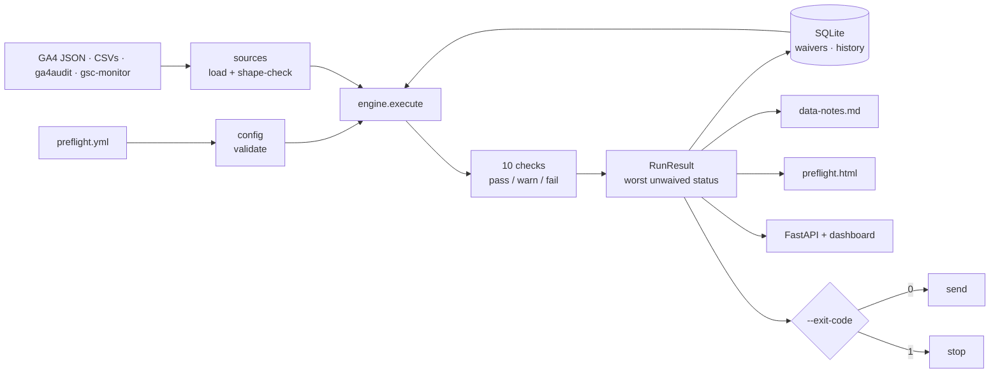

# Report Preflight

[](https://github.com/mehranmoghadasi/marketing-report-preflight/actions/workflows/python-app.yml)
[](https://python.org)
[](LICENSE)
[](docs/CHECKS.md)

> A preflight gate for client marketing reports: run declarative checks on the data behind
> the report, block the send when it is not trustworthy, and hand you the client-facing
> caveat paragraph to paste in when it is.

```
Mockup — dashboard, Overview view (described in full in docs/screenshots/README.md)

┌─ Report Preflight ────────┬──────────────────────────────────────────────────────────┐
│ ● Overview                │  Northgate Plumbing & Heating      Period [2026-08] [Run] │
│   Run history             ├──────────────────────────────────────────────────────────┤
│   Checks & waivers        │  ┌────────────────────────────────────────────────────┐  │
│                           │  │ (FAIL)  Do not send yet          2026-08 · 10 checks│  │
│ CLIENT                    │  │   10          3          5          0               │  │
│ [Northgate Plumbing  ▾]   │  │   checks      blocking   warnings   accepted        │  │
│ 10 checks · 11 sources    │  └────────────────────────────────────────────────────┘  │
│                           │  ▸ (FAIL) ga4-response-complete  truncated 08-29 to 08-31 │
│                           │  ▸ (FAIL) period-complete        3 of 31 days have no…   │
│                           │  ▾ (WARN) consent-stable         denial 34.0% vs 22.0%   │
│                           │      The share of visitors declining analytics consent…  │
│                           │      { "shift_points": 12.0, "warn_points": 5.0, … }     │
│                           │  ▸ (PASS) events-firing          all planned events fir… │
│                           │  ┌─ CLIENT-FACING DATA NOTES ─────────────────────[ Copy ]─┐ │
│                           │  │ Before sending this report we checked the data …     │ │
│                           │  └─────────────────────────────────────────────────────┘ │
└───────────────────────────┴──────────────────────────────────────────────────────────┘
```

## The Problem

Agencies send monthly reports built on data nobody validated, and find out it was wrong
when the client asks. The failure is rarely sloppiness — it is that the data changes
underneath you and nothing tells you:

- A consultancy rebuilding an agency's reporting found the team reconciling five sources by
  hand every week, and clients spotting the discrepancies first
  ([matzanalytics.com](https://www.matzanalytics.com/post/white-label-looker-studio-rebuild-marketing-agency)).
- A PPC agency founder describes duplicate conversions inflating reports, and the
  conversation where the client's real results do not match the deck — her own fix is a
  manually maintained spreadsheet of every conversion action
  ([ppc.live](https://www.ppc.live/post/the-invisible-threat-how-to-prevent-duplicate-conversions-in-google-ads)).
- Search Console logged impressions incorrectly for roughly a year before Google disclosed
  it in a changelog entry, which means every impression-based client report in that window
  was built on bad numbers
  ([getpassionfruit.com](https://www.getpassionfruit.com/research/your-search-console-data-has-been-wrong-for-a-year)).
- Looker Studio data-source claims break while the report keeps rendering; practitioners
  discover it days later
  ([Google developer forums](https://discuss.google.dev/t/claim-to-report-is-broken-error/180030)).
- Marketing-operations roles now list data quality as an explicit responsibility —
  "regular audits", "governance protocols", "reduce human error" — without naming any tool
  that does it (e.g. this Calgary
  [Marketing Operations Specialist posting](https://www.careerbeacon.com/en/job-9/3556239/tec-canada/marketing-operations-specialist/calgary-ab)).

**Why now.** The GA4 Data API's `ResponseMetaData` now documents `dataTruncationReasons[]`
(reference page last updated 2026-09-14)
([reference](https://developers.google.com/analytics/devguides/reporting/data/v1/rest/v1beta/ResponseMetaData)):
GA4 now tells you, in the response, that the numbers it just returned are incomplete — and
no reporting stack reads it. Separately, from 2026-06-15 Google Signals became
reporting-only and Consent Mode's `ad_storage` became the single control over Ads data from
the GA tag ([Analytics Help](https://support.google.com/analytics/answer/17016975)), so
consent changes now reshape reported figures more directly than before.

## The Solution

One declarative file per client lists the inputs you already produce and the checks that
have to pass. One command runs them and produces three things: a verdict, a readiness page,
and a client-safe notes block.

```bash
report-preflight run --client acme-dental --period 2026-08 --exit-code \
  && agency-report-builder --client acme-dental --period 2026-08
```

`--exit-code` returns `1` on any failing check, so the send step never runs on data that
did not clear. If you decide to send anyway, you record a waiver with a reason and a name —
the check keeps failing, it stops blocking, and the reason is quoted to the client.

The verdict rule is deliberately dumb: **the worst unwaived check status wins**
(`fail` > `warn` > `pass`). No weighted score, nothing to fudge, and you can defend it out
loud on a client call.

## How this differs

| Tool | What it does | What it does not do |
|---|---|---|
| [Trackingplan](https://www.trackingplan.com/), [ObservePoint](https://www.observepoint.com/), [DataTrue](https://www.datatrue.com/) | Continuously watch tags, hits, consent state and alert when a release breaks tracking | Nothing is bound to a report or a period: it is an always-on alert stream, and it produces no pass/fail on a deliverable and no client-facing wording |
| [Soda](https://www.soda.io/), [Great Expectations](https://greatexpectations.io/) | Declarative data checks with pipeline circuit breakers — the right mechanism | Live in the warehouse; they know nothing about GA4 response metadata, consent rates, or a monthly client report |
| [AgencyAnalytics](https://agencyanalytics.com/) | Has a report **approval** step before sending | The approval is a human sign-off with no automated data check behind it |
| Looker Studio, Whatagraph, DashThis, [Databox](https://databox.com/) | Assemble and schedule the report; Databox alerts on metric thresholds | They render whatever they are given; a threshold alert fires on a *value*, not on the data being incomplete, sampled, truncated or double-counted |

The gap this fills: nothing on the market gates *report delivery* on *data validity*, and
nothing turns the finding into a paragraph you can put in front of the client. That is the
whole product.

## Features

- **Ten check types** — GA4 response integrity, period completeness, source freshness,
  period-over-period deltas, zero-stream detection, consent-rate shift, GA4 event coverage,
  Search Console index coverage, duplicate conversions, and settings drift
  ([reference](docs/CHECKS.md)).
- **Reads GA4's own incompleteness signals** — `dataTruncationReasons`, `emptyReason`,
  `subjectToThresholding`, `dataLossFromOtherRow` and `samplingMetadatas`, all by their
  documented names.
- **A client-safe data-notes block** composed from the failing checks: plain language, no
  check ids, no file names, no API constants. Copy button in the UI, `data-notes.md` on disk.
- **Exit-code gating** so it works as a real gate in cron or CI, not just a dashboard.
- **Waivers with an audit trail** — reason, who accepted it, optional expiry, stored in
  SQLite and quoted in the notes.
- **Reads the output of other tools** — `audit_report.json` from ga4-event-auditor and the
  JSON report from gsc-coverage-monitor, at their actual schemas.
- **No credentials, ever** — everything is file-based, so it runs on a laptop with no API
  access to the client's property and every check is testable against a fixture.
- **A check that cannot run fails** — a missing file or malformed CSV blocks the send
  instead of being skipped.
- **Dashboard with run history** — client switcher, expandable check cards, a verdict chart
  over the last twelve periods, waiver management; no build step, no framework.
- **Deterministic artefacts** — same data in, byte-identical JSON/HTML/Markdown out, which
  is what makes the committed demo output verifiable.
- **Strict config validation** — unknown check type, undefined source reference, duplicate
  check id and missing required setting are all rejected by name before anything runs.

## Architecture



Trade-offs, in short: file-based ingestion buys testability and no credential handling at
the cost of an export step; worst-status-wins buys defensibility at the cost of nuance;
no frontend build step buys readability at the cost of a CDN dependency for Tailwind.
Longer version, with the request path, in [docs/ARCHITECTURE.md](docs/ARCHITECTURE.md).

## Tech Stack

- Python 3.10+ — `argparse` CLI, FastAPI + uvicorn API, SQLite via `sqlite3`, PyYAML
- Frontend: HTML, Tailwind (Play CDN), one vanilla-JS file, hand-written SVG chart — no build
- Tests: `pytest` (82); lint and format: `ruff`; CI: GitHub Actions on Python 3.10 and 3.12

## Installation

```bash
git clone https://github.com/mehranmoghadasi/marketing-report-preflight.git
cd marketing-report-preflight
pip install -e ".[dev]"
report-preflight --version
```

## Usage

**1. Try it on the synthetic demo client**

```bash
bash examples/demo.sh
```

**2. Check a real client and write the artefacts**

```bash
report-preflight run --client acme-dental --period 2026-08 \
  --clients-dir clients --out reports/acme-dental/2026-08
```

**3. Gate the send**

```bash
report-preflight run --client acme-dental --period 2026-08 --exit-code \
  && send-the-report acme-dental 2026-08
```

**4. Accept a failure you have already explained to the client**

```bash
report-preflight waive --client acme-dental --check period-complete \
  --reason "Analytics outage 29-31 Aug, client informed by email" \
  --by "Mehran" --expires 2026-09-30
```

**5. Dashboard**

```bash
report-preflight serve --clients-dir clients --port 8000
```

Full flag reference, cron example and API table: [docs/USAGE.md](docs/USAGE.md).

## Sample Output

Verbatim from `bash examples/demo.sh` on the committed synthetic data:

```
Report Preflight — Northgate Plumbing & Heating · 2026-08
------------------------------------------------------------
FAIL  ga4-response-complete
      GA4 reports truncated data for 2026-08-29 to 2026-08-31 (DATA_TRUNCATION_TYPE_DATE_RANGE); Report is sampled: 82.0% of events analysed (threshold 95%)
FAIL  period-complete
      3 of 31 days have no data (2026-08-29, 2026-08-30, 2026-08-31)
WARN  sources-fresh
      metrics: last data point is 3 days before period end; consent: last data point is 3 days before period end; conversions: last data point is 3 days before period end
WARN  headline-metrics
      conversions: -38.1% vs last period (370 to 229); revenue: -22.0% vs last period (46,000 to 35,880)
FAIL  nothing-went-silent
      phone_calls: zero this period after 412 last period — tracking has most likely stopped
WARN  consent-stable
      Consent denial rate 34.0% vs 22.0% last period (+12.0 points)
PASS  events-firing
      All planned events are firing with their required parameters
WARN  indexing-steady
      https://northgateplumbing.example/: indexed URL count down 8.1%
WARN  no-double-counting
      6 of 229 conversion rows are repeats (2.6%) — book_appointment (4), form_submit (2)
PASS  settings-unchanged
      All 5 watched setting(s) unchanged since last period
------------------------------------------------------------
DO NOT SEND YET  (3 blocking, 5 warnings, 0 accepted, 10 checks)
```

…followed by the client-facing block, which is what you actually send
([full file](examples/output/data-notes.md)):

```markdown
## Data notes — Northgate Plumbing & Heating · 2026-08

Before sending this report we checked the data behind it and found problems that affect the figures shown. Please read these notes alongside the numbers:

- Google Analytics reported that some of this period's data was not fully available for 2026-08-29 to 2026-08-31, so the totals shown understate actual activity. Google Analytics calculated this period from a sample covering 82% of events rather than all of them, so the figures are close estimates rather than exact counts.
- This report covers 28 of the 31 days in 2026-08; 3 days of data are not available, so period totals are lower than the true figure.
- At least one metric recorded nothing at all this period. This is being treated as a measurement problem rather than a performance result until it is confirmed.
```

And the gate:

```
report-preflight run --exit-code -> 1   (1 = do not send)
```

## Limitations

- **It does not fetch anything.** Preflight reads files. Getting this month's GA4 response,
  metrics CSV and settings snapshot onto disk is your job (export, script, or another tool).
- **Monthly periods only.** Periods are `YYYY-MM`; weekly and campaign-window reporting are
  not supported.
- **It cannot detect what your data does not record.** Traffic that was never tracked, a tag
  that never existed, offline conversions absent from the CSV — none of that is visible here.
- **Thresholds are judgement, not truth.** A 20% swing is normal for one client and alarming
  for another. The defaults are starting points; the tool is only as good as the numbers you
  put in the YAML.
- **`config_drift` compares snapshots you provide.** It does not read settings from GA4 or
  Google Ads, so it only catches drift in what you bothered to snapshot.
- **No auth on the dashboard.** It binds to `127.0.0.1`; put it behind a proxy or a tunnel
  before exposing it, and note that anyone who can reach it can run checks and file waivers.
- **`duplicate_conversions` needs an id column.** It finds repeated `conversion_id` values;
  it cannot spot two genuinely distinct records that represent the same real-world action.
- **The UI loads Tailwind from the Play CDN**, so first paint needs network access. Vendor a
  built `tailwind.css` into `src/preflight/web/` if you need it fully offline.
- **Single-user by design.** SQLite, one process, no accounts, no multi-tenant separation.

## Related Projects

- [ga4-event-auditor](https://github.com/mehranmoghadasi/ga4-event-auditor) — produces the
  `audit_report.json` that the `event_coverage` check reads.
- [gsc-coverage-monitor](https://github.com/mehranmoghadasi/gsc-coverage-monitor) — produces
  the JSON report that the `index_coverage` check reads.
- [agency-report-builder](https://github.com/mehranmoghadasi/agency-report-builder) — the
  step you put *after* the gate: it builds the branded client report.
- [ab-test-significance-toolkit](https://github.com/mehranmoghadasi/ab-test-significance-toolkit)
  — the same instinct applied to experiments: do not call a result before the data supports it.

## Roadmap

1. Weekly and arbitrary date-range periods, not just calendar months.
2. A `--baseline` mode that learns each client's normal month-over-month range instead of
   using hand-set thresholds.
3. Google Ads change-history ingestion so `config_drift` can watch settings it was not given.
4. Slack / email delivery of the notes block when a run blocks.
5. A second client in `examples/` whose August is clean, to show the pass path end to end.
6. Optional signed archive of each run so a past verdict can be proven after the fact.

## Project Structure

```
marketing-report-preflight/
├── ci/python-app.yml                  # workflow to add by hand (see Contributing)
├── docs/
│   ├── ARCHITECTURE.md
│   ├── CHECKS.md                      # every check, every setting, every formula
│   ├── USAGE.md
│   └── screenshots/README.md          # the interface, described
├── examples/
│   ├── clients/northgate-plumbing/    # preflight.yml + synthetic 2026-07 and 2026-08 data
│   ├── demo.sh
│   ├── make_example_data.py
│   ├── output/                        # committed artefacts of the demo run
│   └── README.md
├── src/preflight/
│   ├── api.py                         # FastAPI app + static hosting
│   ├── checks/                        # completeness · config_drift · conversions
│   │                                  # coverage · deltas · ga4_response + registry
│   ├── cli.py                         # run · serve · waive · history · clients · checks
│   ├── config.py                      # preflight.yml parsing and validation
│   ├── db.py                          # SQLite schema, runs, waivers
│   ├── engine.py                      # orchestration and the verdict
│   ├── model.py                       # Severity, CheckResult, RunResult, Waiver
│   ├── notes.py                       # client-facing data notes
│   ├── periods.py                     # YYYY-MM arithmetic
│   ├── report.py                      # standalone HTML + console renderers
│   ├── sources.py                     # file loaders and shape checks
│   └── web/                           # index.html · app.js · app.css
├── tests/                             # 82 tests
├── pyproject.toml
└── LICENSE
```

## Contributing

PRs welcome — especially new check types and real-world shapes of the files these checks
read. A check is a single function returning a `CheckResult`; add it to a module in
`src/preflight/checks/`, register it in that module's `DEFS`, document the formula in
`docs/CHECKS.md`, and add a test with a hand-computed number.

Before opening a PR: `ruff check src tests examples && pytest -q && bash examples/demo.sh`,
then confirm `examples/output` is unchanged.

CI lives in `ci/python-app.yml`; copy it to `.github/workflows/python-app.yml` to enable it
on a fork.

## Changelog

**1.0.1 — 2026-09-20**

- `preflight.json` is now written as UTF-8 text (`ensure_ascii=False`) instead of `\uXXXX` escapes. The first CI run caught that the committed demo output and a fresh run differed only in how an em-dash was encoded — a reproducibility bug in the writer, fixed in the writer.

**1.0.0 — 2026-09-20**

- First release: 10 check types, verdict rule, waivers with audit trail, client-facing data
  notes, standalone HTML readiness page, CLI with exit-code gating, FastAPI + dashboard,
  SQLite history, synthetic demo client, 82 tests.

## License

MIT — see [LICENSE](LICENSE).

## About the Author

**Mehran Moghadasi** — Digital Marketing & Brand Manager (SEO · Google Ads · Meta Ads ·
Social Media), Calgary, AB.
[github.com/mehranmoghadasi](https://github.com/mehranmoghadasi) ·
[linkedin.com/in/mehranmoghadasi](https://www.linkedin.com/in/mehranmoghadasi)
