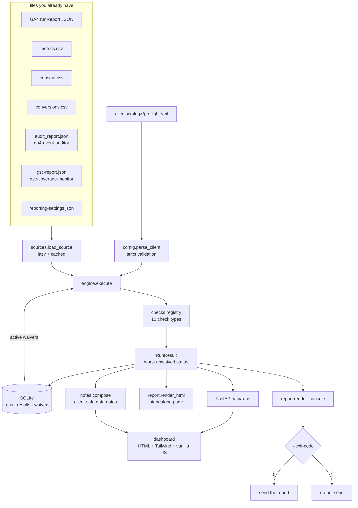

# Architecture

## Layers

| Layer | Module | Responsibility |
|---|---|---|
| Config | `config.py` | Parse and validate `preflight.yml`; fail loudly with the offending key. |
| Ingestion | `sources.py` | Read and shape-check files. No network, no credentials. |
| Checks | `checks/*.py` | Pure functions `(CheckContext) -> CheckResult`. |
| Orchestration | `engine.py` | Run checks, apply waivers, derive the verdict. |
| Persistence | `db.py` | SQLite run history and waivers; one write per run. |
| Output | `notes.py`, `report.py` | Client-safe notes, standalone HTML, console text. |
| Interfaces | `cli.py`, `api.py`, `web/` | Same engine behind a CLI, a REST API and a dashboard. |

## Design decisions and their trade-offs

**File-based ingestion, not API clients.** No OAuth, no service accounts, no stored
credentials, and every check is testable against a committed fixture. The cost is a manual
or scripted export step; Preflight sits *after* whatever already fetches your data.

**A check that cannot run fails.** A gate that silently skips a broken check is worse than
no gate. The cost is noise when a client's config points at a file that does not exist yet
— which is exactly the failure you want surfaced on the 1st of the month.

**Worst-status-wins instead of a score.** A 0–100 "data quality score" is impossible to
defend in a client conversation, and tempting to fudge. The rule here is `fail > warn >
pass`, recomputable by eye. The cost is that ten small warnings never add up to a block.

**Waivers instead of threshold-editing.** When you decide to send anyway, that decision is
recorded with a reason and a name, the reason is quoted to the client, and the check keeps
failing next month. The cost is one more concept; the benefit is that nobody quietly
raises a threshold to make a check go away.

**SQLite, one file.** History and waivers need to survive restarts and be greppable, not
scale. The schema is created on connect, so there are no migrations to run.

**No frontend build step.** The dashboard is HTML, Tailwind from the Play CDN, and one
vanilla-JS file served by the same process. Anyone can read it, and there is no
`node_modules` to age. The cost is that first paint needs network access for Tailwind and
that the UI is not a component library.

## Request path for a run

1. `POST /api/runs {client, period}` (or `report-preflight run`).
2. `load_client` validates the config; unknown client → 404, bad period → 400.
3. Active waivers are read from SQLite.
4. `engine.execute` resolves each source at most once and runs each check in config order.
5. The verdict is the worst effective status; the run and its results are persisted.
6. The response carries the checks, the counts and the composed data notes.
